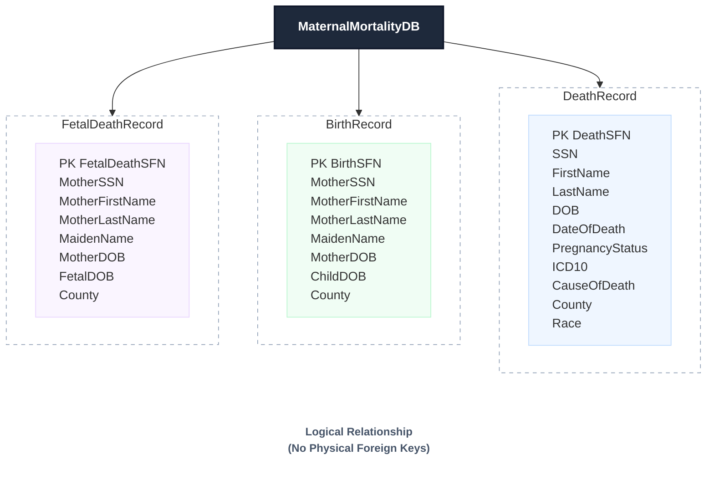
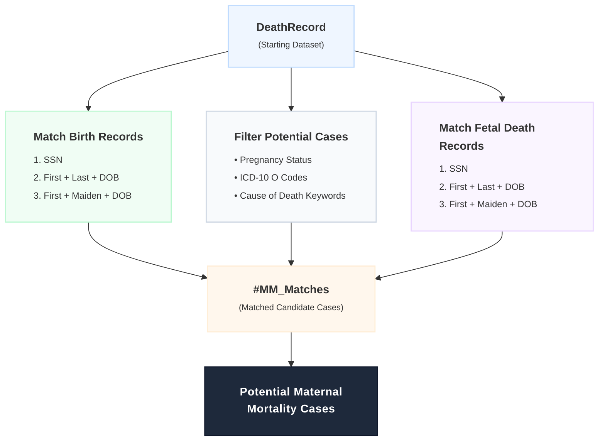
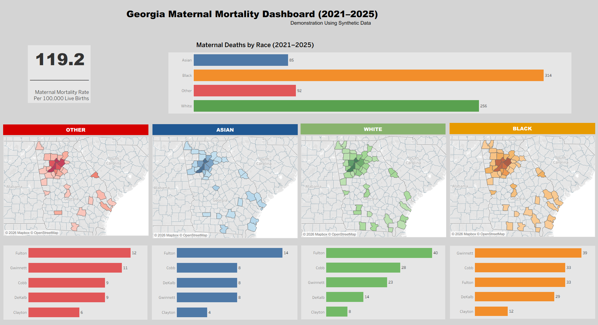

# Maternal Mortality Case Identification Using SQL Server

## 1. Project Overview

This project demonstrates a SQL Server solution for identifying potential maternal mortality cases by integrating multiple vital records datasets. It was developed using **synthetic data** to simulate real-world public health data quality workflows while protecting confidential information.

The workflow begins with death records and identifies potential maternal mortality cases by applying multiple matching strategies, including pregnancy indicators, ICD-10 pregnancy-related diagnosis codes, cause-of-death keywords, and record linkage with Birth and Fetal Death records.

The objective is to demonstrate how SQL can support public health surveillance, data quality improvement, and maternal mortality case identification.

---

## 2. Matching Criteria

Potential maternal mortality cases are identified using multiple complementary matching strategies.

### Pregnancy Indicators

* Pregnancy status recorded on the death certificate

 ### Record Linkage

* Match to Birth Records using Social Security Number (SSN)
* Match to Fetal Death Records using Social Security Number (SSN)
* Match using Mother's Name and Date of Birth
* Match using Mother's Maiden Name and Date of Birth

 ### Clinical Indicators

* Pregnancy-related ICD-10 O-codes
* Pregnancy-related cause-of-death keywords

Matched records from each strategy are consolidated into a temporary table and returned as a final list of potential maternal mortality cases for further review.

---

## 3. Objectives

* Design a relational SQL Server database for maternal mortality analysis.
* Demonstrate advanced SQL querying and multi-step record matching.
* Simulate a real-world public health data quality workflow.
* Develop a reusable SQL process for maternal mortality case identification and validation.

---

## 4. Technologies Used

* Microsoft SQL Server
* Transact-SQL (T-SQL)
* Temporary Tables
* SQL Joins
* CASE Expressions
* Conditional Logic
* Record Matching Techniques

---

## 5. Project Highlights

* Multi-source record matching
* Multiple matching strategies to improve case identification
* Pregnancy status validation
* ICD-10 O-code identification
* Cause-of-death keyword analysis
* Temporary table workflow
* Clean, modular, and well-documented SQL scripts

---

## 6. Disclaimer

This project uses **synthetic data** created exclusively for portfolio and educational purposes.

Although the workflow is inspired by public health data quality processes used in vital records management, **no production data, confidential information, or personally identifiable information (PII) is included**.

The project is intended solely to demonstrate SQL development, record linkage techniques, and data quality methodologies.

---

## 7. Database ERD

---

## 8. SQL Matching Workflow

---

## 9. SQL Script

This project includes a complete SQL Server implementation for maternal mortality case identification.

The SQL script demonstrates:

- Defining the reporting period
- Creating temporary matching tables
- Matching Birth Records by SSN
- Matching Fetal Death Records by SSN
- Matching by Mother's Name and Date of Birth
- Matching by Maiden Name and Date of Birth
- Identifying pregnancy-related ICD-10 O-codes
- Searching pregnancy-related cause-of-death keywords
- Returning consolidated potential maternal mortality cases

### SQL Source Code

➡️ **[MaternalMortalityCaseIdentification.sql](MaternalMortalityCaseIdentification.sql)**

The SQL script is fully documented with step-by-step comments to demonstrate the complete matching workflow and data quality process.

---

## 10. Sample SQL Output

The SQL script demonstrates the maternal mortality case identification workflow using a synthetic **2025** dataset.

The sample output below illustrates how death records are matched to birth records through the multi-step matching process.

| Death SFN | Date of Death | First Name | Last Name | ICD-10 | Cause of Death | Race | County |
|-----------|---------------|------------|-----------|--------|----------------|------|--------|
| 2025GA000617 | 01/04/2025 | David | Thomas | C34 | Cancer | Black | Bartow |
| 2025GA000579 | 01/22/2025 | Joseph | Wilson | J44 | ectopic | Other | Coweta |
| 2025GA000575 | 01/24/2025 | William | Garcia | J44 | eclampsia | Asian | Effingham |
| 2025GA000588 | 01/30/2025 | Robert | Anderson | O96 | Cancer | White | Gordon |
| 2025GA000581 | 02/06/2025 | John | Jones | I21 | abruptio | Asian | Fulton |
| 2025GA000580 | 04/01/2025 | Joseph | Garcia | I50 | uterine rupture | White | Fulton |

### Complete Sample Dataset

The complete sample dataset is available below.

➡️ **[MaternalMortalityOutput2025.csv](MaternalMortalityOutput2025.csv)**

> **Note:** All records shown are synthetic and are intended solely for demonstrating SQL-based record linkage and maternal mortality case identification techniques.

---

## 11. Tableau Dashboard

The SQL output generated in this project serves as the data source for an interactive Tableau dashboard.

The dashboard will include:

## Dashboard Preview

- Maternal Mortality Rate (per 100,000 live births)
- Maternal Deaths by Race
- County-level geographic analysis
- Top counties by race
- Interactive filters

### Interactive Dashboard

[View on Tableau Public](https://public.tableau.com/views/YourDashboardName)

## Methodology

- Maternal death records were generated using synthetic data.
- Live birth totals (2021–2025) were obtained from the Georgia OASIS database.
- Maternal Mortality Rate was calculated as:

  **(Maternal Deaths ÷ Live Births) × 100,000**

> **Note:** This dashboard uses synthetic maternal mortality data for portfolio purposes and does not represent official Georgia public health statistics.

---

## 12. Future Enhancements

Future enhancements may include:

- Additional statistical analyses using R.
- Advanced data visualizations with ggplot2.
- Expanded public health trend analysis using Georgia OASIS data.

### Example R Analysis

**R Source Code:** [Birth_Trend_Analysis.R](Birth_Trend_Analysis.R)

